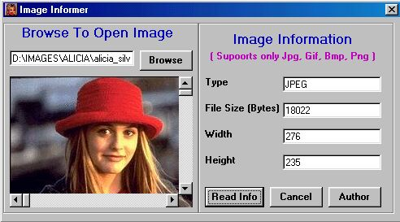



## Image Informer

### Description

Image Informer is a simple program which shows basic information about image like Type of image, Height, Width, FileSize etc. In Image Informer you can see the image also. Image Informer only supports Jpg, Gif, Bmp and Png Files. All the Error handling is done. You can easily understand the program. If u like this program pls Vote for me.
 
### More Info
 

             |
---                |---
**Submitted On**   |2002-04-11 01:56:04
**By**             |[inderpal](https://github.com/Planet-Source-Code/PSCIndex/blob/master/ByAuthor/inderpal.md)
**Level**          |Intermediate
**User Rating**    |4.5 (45 globes from 10 users)
**Compatibility**  |VB 5\.0, VB 6\.0
**Category**       |[Complete Applications](https://github.com/Planet-Source-Code/PSCIndex/blob/master/ByCategory/complete-applications__1-27.md)
**World**          |[Visual Basic](https://github.com/Planet-Source-Code/PSCIndex/blob/master/ByWorld/visual-basic.md)
**Archive File**   |[Image\_Info708984102002\.zip](https://github.com/Planet-Source-Code/inderpal-image-informer__1-33650/archive/master.zip)

